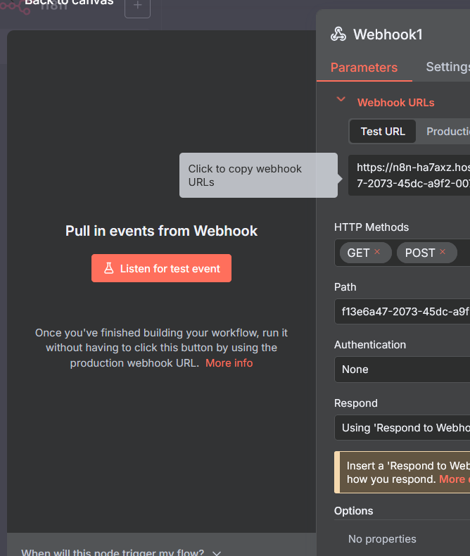
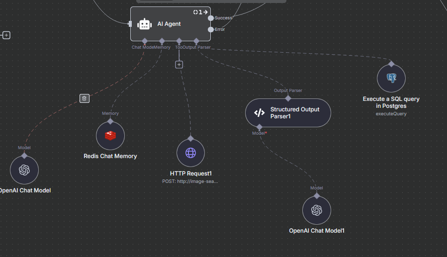
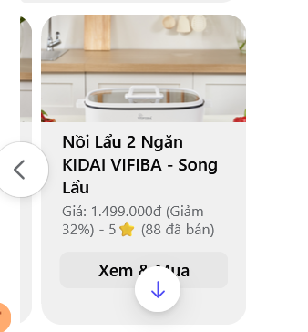

## AI Agentic-RAG Chatbot

# 1. Overview:

If you have understood about RAG (Retrieval Augmented Generation), you must know that if you want your Agent to answer based on the document has given.

But when we work with structured data, we want to search for the target column first then get information based on another column. Like selling chatbot, we might want to first search the product name or category, then we let AI to get description of it, or maybe we want to filter the data with same category first then answer to user, not always answer everything we have retrieved.

The agentic-RAG is the best way for that, it first search the column need based on user query, then it retrieve information based on the column. Or it will bypass the column search process base on the instruction given.

# 2. Setup:
Go to previous and setup the docker compose file, it will contains every service need.

# 3. Retrieval Module:

I use the Milvus Vector Database to retrieve data from it. As first, we must push data inside Milvus. The document is available in https://milvus.io/ 

Or, you can follow the milvus.ipynb inside app directory.

There are 2 retrieve module: 
1. milvus.ipynb: This is image retrieve module with Milvus
2. agent.ipynb: This is text retrieve module with Milvus

After that, I encapsulate it inside FastAPI app, now N8N workflow can send request to it to retrieve information

# 4. Handle Messenger Request:

Go to https://www.developers.facebook.com  to register app service, then setup the webhook 

Create Webhook Node to receive message 

You can test with webhook-test first then use just webhook to deploy the app.

# 5. Agentic RAG Agent:

The Agentic RAG Agent needs the 5 most important components which are ChatModel for inference, Redis Memory to manage history, HTTP Request use to get semantic search based on image or text, Postgres Tool for further process based on structured database, Structured Parse Output to parse the output to the right format need.

# 6. Further Process:

a. Typing:
When user send an message, we might want to send user the typing message, it sounds simple but in N8N there is no way we can handle multithread or multiprocess, we dont have any way for 1 thread to handle a request another thread is to check for the request is finish or not to decide to send user a typing.

So the simple way is create another workflow and when user send request we trigger it by the user_id, a lot of message queue can be used but I choose MQTT because we just need to send a really small message like user_id and boolean option whether to send typing to user or not.

b. Genaric Format For Facebook Messenger Response:

Like I said in the AI Agent, the Output Parser is important, we can parse the output response by getting data in side structured database to structured format that fit the generic format of Facebook Messenger and we can send the image with url and content of product that make the interface better.

