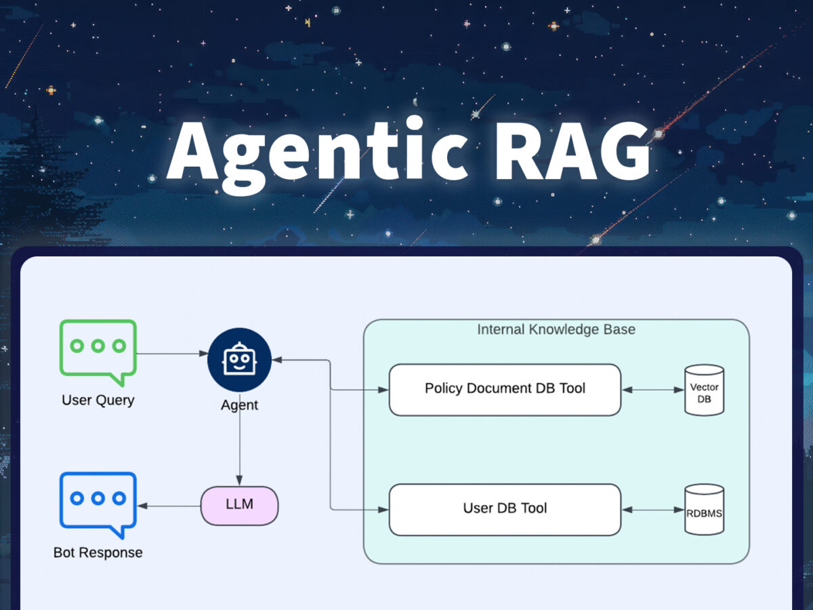

## AI Agentic-RAG Chatbot

# 1. Overview:

If you have understood about RAG (Retrieval Augmented Generation), you must know that if you want your Agent to answer based on the document has given.

But when we work with structured data, we want to search for the target column first then get information based on another column. Like selling chatbot, we might want to first search the product name or category, then we let AI to get description of it, or maybe we want to filter the data with same category first then answer to user, not always answer everything we have retrieved.

The agentic-RAG is the best way for that, it first search the column need based on user query, then it retrieve information based on the column. Or it will bypass the column search process base on the instruction given.

# 2. Setup:
Go to previous and setup the docker compose file, it will contains every service need.

# 3. Retrieval Module:

I use the Milvus Vector Database to retrieve data from it. As first, we must push data inside Milvus. The document is available in https://milvus.io/ 

Or, you can follow the milvus.ipynb inside app directory.

There are 2 retrieve module: 
1. milvus.ipynb: This is image retrieve module with Milvus
2. agent.ipynb: This is text retrieve module with Milvus

After that, I encapsulate it inside FastAPI app, now N8N workflow can send request to it to retrieve information

# 4. Handle Messenger Request:

Go to https://www.developers.facebook.com  to register app service, then setup the webhook 

Create Webhook Note to receive message 

